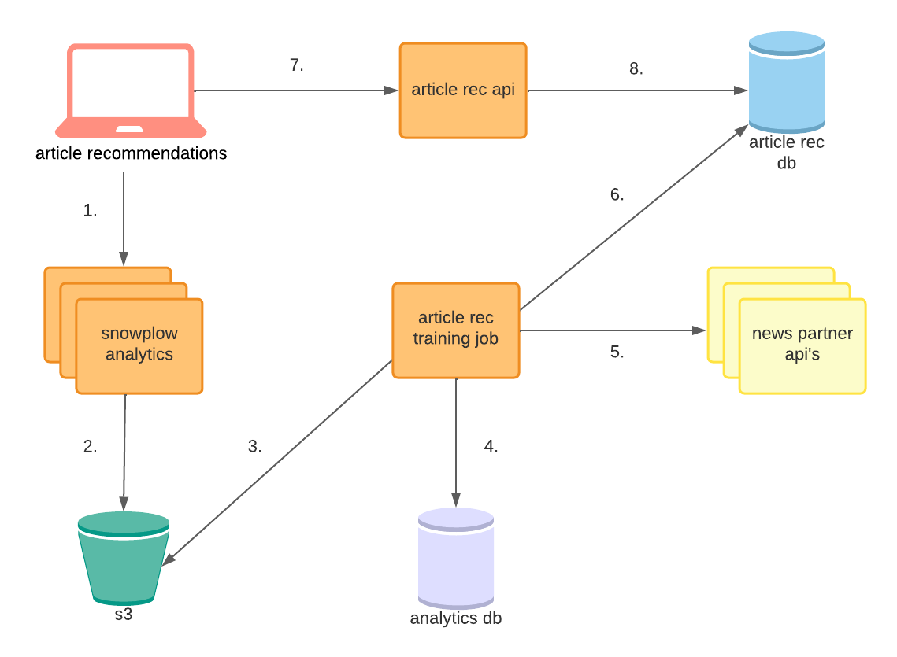

# article-rec-api

Serves recommended articles for news sites.

# API Usage

## Error Codes
- 200: OK
- 400: VALIDATION ERROR
- 500: INTERNAL SERVER ERROR

## Endpoints

### `GET /recs`

#### PARAMS
**site** (required)

The site to pull recommendations for.

**source_entity_id** (required)

The article for which you want recommendations, specified by the id from your news site's data store.

**model_type** (optional)

The type of model for which you want recommendations. This should always be `article` in production contexts.

If a model_id is provided, it overrides this input.

**model_id** (optional)

The specific model for which you want recommendations. This is useful in testing environments.

If a model_id is provided, it overrides the model_type.

**exclude** (optional)

A comma-separated list of article id's from your news site's data store to exclude from the results.

**sort_by** (optional)

The field to sort results by. This can be any top-level attribute of a recommendation.

**order_by** (optional)

Either asc for ascending or desc for descending. This value defaults to desc.

#### EXAMPLE REQUEST
```
GET /recs?site=daily-scoop&source_entity_id=10&model_type=article&sort_by=score
```

#### EXAMPLE RESPONSE
```

{
    "results": [
        {
            "id": 14208707,
            "created_at": "2021-11-12T15:55:53.050616+00:00",
            "updated_at": "2021-11-12T15:55:53.050649+00:00",
            "source_entity_id": "10",
            "model": {
                "id": 1621,
                "created_at": "2021-11-12T15:55:02.316918+00:00",
                "updated_at": "2021-11-12T15:56:44.388045+00:00",
                "type": "article",
                "status": "current"
            },
            "recommended_article": {
                "id": 62556,
                "created_at": "2021-11-12T15:36:55.670721+00:00",
                "updated_at": "2021-11-12T15:36:55.670743+00:00",
                "external_id": "1",
                "title": "Who is Montero?",
                "path": "/article/who-is-montero",
                "published_at": "2021-04-09T22:00:00+00:00"
            },
            "score": "0.861924"
        },
        ...
    ]
}
```

### `GET /models`

#### PARAMS
**status** (optional)

The status of the model. This can be `current`, `pending`, `stale`, or `failed`.

**type** (optional)

The type of the model. This can be `article` or `popularity`.

**sort_by** (optional)

The field to sort results by. This can be any top-level attribute of a recommendation.

**order_by** (optional)

Either asc for ascending or desc for descending. This value defaults to desc.

#### EXAMPLE REQUEST
```
GET /models?type=article&status=stale&sort_by=created_at
```

#### EXAMPLE RESPONSE

```
{
    "results": [
        {
            "id": 1630,
            "created_at": "2021-11-15T00:02:51.326462+00:00",
            "updated_at": "2021-11-16T00:23:54.091209+00:00",
            "type": "article",
            "status": "stale"
        },
        ...
    ]
}
```

# Development
## Directory Layout
```
.
├── cdk       # infrastructure as code for this service
├── db        # object-relational mappings to interact with the database
├── handlers  # logic to handle api requests
├── lib       # helpers to interact with lnl's aws resources
└── tests     # unit tests
```

## Environment

Environment parameters are defined in `env.json`.

You can add a new secret parameter [using AWS SSM](https://www.notion.so/Working-with-SSM-Parameters-82df52fd71b24762b541cc8439f40e4e).

## Local Usage
1. Build the container
```
kar build
```

2. Run the api
```
kar run
```

## Running Tests
1. Build the container
```
kar build
```

2. Run unit tests
```
kar test
```

## Deploying
For dev deployment, run:

```
kar deploy
```

Each pull request to main will trigger a new prod deployment when merged.

## Monitoring

### Logs
- [Dev](https://console.aws.amazon.com/cloudwatch/home?region=us-east-1#logsV2:log-groups/log-group/DevArticleRecAPI-DevArticleRecAPIServiceTaskDefwebLogGroupF7CBBE61-aj8kV8MTSYXW/log-events$3Fstart$3D-3600000)
- [Prod](https://console.aws.amazon.com/cloudwatch/home?region=us-east-1#logsV2:log-groups/log-group/ArticleRecAPI-ArticleRecAPIServiceTaskDefwebLogGroup4ADC2B59-QUdq30I9QQvt/log-events$3Fstart$3D-3600000)

### Dashboards
- [Dev](https://console.aws.amazon.com/cloudwatch/home?region=us-east-1#dashboards:name=dev-article-rec-api;start=PT24H)
- [Prod](https://console.aws.amazon.com/cloudwatch/home?region=us-east-1#dashboards:name=article-rec-api;start=PT24H)

## Other Resources

### Misc Documentation
* [Monitoring Guide](https://www.notion.so/article-rec-backend-monitoring-30915f77759c4350b1b8588582c9ea04)

### Related Repositories
* [`infrastructure`](https://github.com/LocalAtBrown/infrastructure): The database and ECS clusters are created here.
* [`article-rec-db`](https://github.com/LocalAtBrown/article-rec-db): The relevant database migrations are defined and applied here.
* [`article-rec-training-job`](https://github.com/LocalAtBrown/article-rec-training-job): The job that runs on a regular interval, training the recommendation model and saving the predictions that are served by this API to the database.
* [`snowplow-analytics`](https://github.com/LocalAtBrown/snowplow-analytics): The analytics pipeline used to collect user clickstream data into s3 is defined in this repository.
* [`article-recommendations`](https://github.com/LocalAtBrown/article-recommendations): The PHP widget that makes requests to this API, displaying recommendations WordPress [NewsPack](https://newspack.pub/) sites.

### Architecture Diagram

